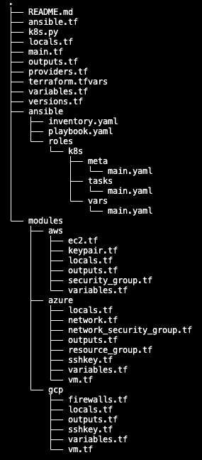

# bootstrap_k8s_terraform
Kubernetes Cluster bootstrapped via Terraform and Ansible in AWS, Azure, and/or GCP.  
**The resource tls_private_key is stored unencrypted in state file. Not for production.**

## Requirements
- Python 3
- Terraform CLI
- Ansible CLI
- Preferred Cloud Credentials

## Deployment Instructions
1. Update [terraform.tfvars](./terraform.tfvars).
   1. `cloud_provider`: provides k8s.py with information to automate commenting of modules
   2. `project_id`: string to be used as an identifier in provisioned cloud resources.
   3. `vm_names`: identifiers for provisioned machines and ansible host names
      1. **NOTE: the first key will be the assumed controller node while creating the inventory file.**
   4. `aws`: required credentials and instance information
      1. Ansible configuration is for AWS Linux 2 images
      2. Kubernetes requires at least 2 cores
   5. `azure`: required credentials, resource group location, network address space, and virtual machine information
      1. Ansible configuration tested on CentOS 8_5
      2. Kubernetes requires at least 2 cores
   6. `gcp`: required credentials, network, and machine data.
      1. Ansible configuration tested on CentOS stream 8
      2. Kubernetes requires at least 2 cores
2. Initialize Terraform project and apply: `python3 k8s.py terraform.tfvars init`
3. Upgrade and apply Terraform changes: `python3 k8s.py terraform.tfvars upgrade`
4. Destroy Terraform project: `python3 k8s.py terraform.tfvars`

## Overview
| **Files**                                                                                                                                                                                                                                                                                                                                                                                                                                                                                                                                                                                                                                                                                                                                                                                                                                                                                                                                                                | **Implementation**                                            |
|--------------------------------------------------------------------------------------------------------------------------------------------------------------------------------------------------------------------------------------------------------------------------------------------------------------------------------------------------------------------------------------------------------------------------------------------------------------------------------------------------------------------------------------------------------------------------------------------------------------------------------------------------------------------------------------------------------------------------------------------------------------------------------------------------------------------------------------------------------------------------------------------------------------------------------------------------------------------------|---------------------------------------------------------------|
|  |  |

## Resources Created
- Each cloud provider module used will create:
  - ./ansible/<cloud_provider>_hosts.txt
  - ./ansible/<cloud_provider>_<project/key_pair_name>.pem

### AWS
- [key pair](./modules/aws/keypair.tf)
- [2 security groups](./modules/aws/security_group.tf)
- [EC2 instances](./modules/aws/ec2.tf)
  - default is 3
    - controller
    - worker1
    - worker2

### Azure
- [resource group](./modules/azure/resource_group.tf)
- [tls_private_key](./modules/azure/sshkey.tf)
- [2 network security groups](./modules/azure/network_security_group.tf)
- [virtual network](./modules/azure/network.tf)
- [virtual machines](./modules/azure/vm.tf)
  - default is 3
    - controller
    - worker1
    - worker2

### GCP
- [tls_private_key](./modules/gcp/sshkey.tf)
- [firewalls](./modules/gcp/firewalls.tf)
- [virtual machines](./modules/gcp/vm.tf)
  - default is 3
    - controller
    - worker1
    - worker2

