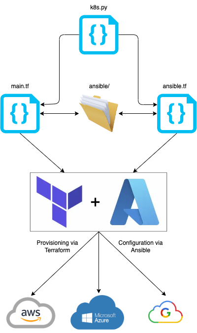

# bootstrap_k8s_terraform
Kubernetes Cluster bootstrapped via Terraform and Ansible in AWS, Azure, and/or GCP.  
**The resource tls_private_key is stored unencrypted in state file. Not for production.**

## Requirements
- Python 3
- Terraform CLI
- Ansible CLI
- Preferred Cloud Credentials

## Deployment Instructions
1. Update [terraform.tfvars](./terraform.tfvars).
   1. `cloud_provider`: provides k8s.py with information to automate commenting of modules
   2. `project_id`: string to be used as an identifier in provisioned cloud resources.
   3. `vm_names`: identifiers for provisioned machines and ansible host names
      1. **NOTE: the first key will be the assumed controller node while creating the inventory file.**
   4. `aws`: required credentials and instance information
      1. Ansible configuration is for AWS Linux 2 images
      2. Kubernetes requires at least 2 cores
   5. `azure`: required credentials, resource group location, network address space, and virtual machine information
      1. Ansible configuration tested on CentOS 8_5
      2. Kubernetes requires at least 2 cores
   6. `gcp`: required credentials, network, and machine data.
      1. Ansible configuration tested on CentOS 8_5
      2. Kubernetes requires at least 2 cores
2. Initialize Terraform project and apply: `python3 k8s.py terraform.tfvars init`
3. Upgrade and apply Terraform changes: `python3 k8s.py terraform.tfvars upgrade`
4. Destroy Terraform project: `python3 k8s.py terraform.tfvars`

## Overview
| **Files**                                                                                                                                                                                                                                                                                                                                                                                                                                                                                                                                                                                                                                                                                                                                                                                                                                                                                                                                                                | **Implementation**                                            |
|--------------------------------------------------------------------------------------------------------------------------------------------------------------------------------------------------------------------------------------------------------------------------------------------------------------------------------------------------------------------------------------------------------------------------------------------------------------------------------------------------------------------------------------------------------------------------------------------------------------------------------------------------------------------------------------------------------------------------------------------------------------------------------------------------------------------------------------------------------------------------------------------------------------------------------------------------------------------------|---------------------------------------------------------------|
| <code>. ├──&nbsp;README ├──&nbsp;ansible/ │&nbsp;&nbsp;&nbsp;├──&nbsp;inventory.yaml │&nbsp;&nbsp;&nbsp;├──&nbsp;playbook.yaml │&nbsp;&nbsp;&nbsp;└──&nbsp;roles/ │&nbsp;&nbsp;&nbsp;&nbsp;&nbsp;&nbsp;&nbsp;└──&nbsp;k8s/ │&nbsp;&nbsp;&nbsp;&nbsp;&nbsp;&nbsp;&nbsp;&nbsp;&nbsp;&nbsp;&nbsp;├──&nbsp;meta/ │&nbsp;&nbsp;&nbsp;&nbsp;&nbsp;&nbsp;&nbsp;&nbsp;&nbsp;&nbsp;&nbsp;│&nbsp;&nbsp;&nbsp;└──&nbsp;main.yaml │&nbsp;&nbsp;&nbsp;&nbsp;&nbsp;&nbsp;&nbsp;&nbsp;&nbsp;&nbsp;&nbsp;├──&nbsp;tasks/ │&nbsp;&nbsp;&nbsp;&nbsp;&nbsp;&nbsp;&nbsp;&nbsp;&nbsp;&nbsp;&nbsp;│&nbsp;&nbsp;&nbsp;└──&nbsp;main.yaml │&nbsp;&nbsp;&nbsp;&nbsp;&nbsp;&nbsp;&nbsp;&nbsp;&nbsp;&nbsp;&nbsp;└──&nbsp;vars/ │&nbsp;&nbsp;&nbsp;&nbsp;&nbsp;&nbsp;&nbsp;&nbsp;&nbsp;&nbsp;&nbsp;&nbsp;&nbsp;&nbsp;&nbsp;└──&nbsp;main.yaml ├──&nbsp;ansble.tf ├──&nbsp;k8s.py ├──&nbsp;locals.tf ├──&nbsp;main.tf ├──&nbsp;modules/ │&nbsp;&nbsp;&nbsp;├──&nbsp;aws/ │&nbsp;&nbsp;&nbsp;│&nbsp;&nbsp;&nbsp;├──&nbsp;ec2.tf │&nbsp;&nbsp;&nbsp;│&nbsp;&nbsp;&nbsp;├──&nbsp;keypair.tf │&nbsp;&nbsp;&nbsp;│&nbsp;&nbsp;&nbsp;├──&nbsp;locals.tf │&nbsp;&nbsp;&nbsp;│&nbsp;&nbsp;&nbsp;├──&nbsp;outputs.tf │&nbsp;&nbsp;&nbsp;│&nbsp;&nbsp;&nbsp;├──&nbsp;security_group.tf │&nbsp;&nbsp;&nbsp;│&nbsp;&nbsp;&nbsp;└──&nbsp;variables.tf │&nbsp;&nbsp;&nbsp;├──&nbsp;azure/ │&nbsp;&nbsp;&nbsp;│&nbsp;&nbsp;&nbsp;├──&nbsp;locals.tf │&nbsp;&nbsp;&nbsp;│&nbsp;&nbsp;&nbsp;├──&nbsp;network.tf │&nbsp;&nbsp;&nbsp;│&nbsp;&nbsp;&nbsp;├──&nbsp;network_security_group.tf │&nbsp;&nbsp;&nbsp;│&nbsp;&nbsp;&nbsp;├──&nbsp;outputs.tf │&nbsp;&nbsp;&nbsp;│&nbsp;&nbsp;&nbsp;├──&nbsp;resource_group.tf │&nbsp;&nbsp;&nbsp;│&nbsp;&nbsp;&nbsp;├──&nbsp;sshkey.tf │&nbsp;&nbsp;&nbsp;│&nbsp;&nbsp;&nbsp;├──&nbsp;variables.tf │&nbsp;&nbsp;&nbsp;│&nbsp;&nbsp;&nbsp;└──&nbsp;vm.tf │&nbsp;&nbsp;&nbsp;└──&nbsp;gcp/ │&nbsp;&nbsp;&nbsp;&nbsp;&nbsp;&nbsp;&nbsp;├──&nbsp;firewalls.tf │&nbsp;&nbsp;&nbsp;&nbsp;&nbsp;&nbsp;&nbsp;├──&nbsp;locals.tf │&nbsp;&nbsp;&nbsp;&nbsp;&nbsp;&nbsp;&nbsp;├──&nbsp;outputs.tf │&nbsp;&nbsp;&nbsp;&nbsp;&nbsp;&nbsp;&nbsp;├──&nbsp;sshkey.tf │&nbsp;&nbsp;&nbsp;&nbsp;&nbsp;&nbsp;&nbsp;├──&nbsp;variables.tf │&nbsp;&nbsp;&nbsp;&nbsp;&nbsp;&nbsp;&nbsp;└──&nbsp;vm.tf ├──&nbsp;outputs.tf ├──&nbsp;providers.tf ├──&nbsp;terraform.tfvars ├──&nbsp;variables.tf └──&nbsp;versions.tf </code> |  |

## Resources Created
- Each cloud provider module used will create:
  - ./ansible/<cloud_provider>_hosts.txt
  - ./ansible/<cloud_provider>_<project/key_pair_name>.pem

### AWS
- [key pair](./modules/aws/keypair.tf)
- [security groups](./modules/aws/security_group.tf)
  - k8s controller security group (var.sg_k8s_controller_ingress)
  - worker security groups (var.sg_k8s_worker_ingress)
- [EC2 instances](./modules/aws/ec2.tf)
  - default is 3
    - controller
    - worker1
    - worker2

### Azure
- [resource group](./modules/azure/resource_group.tf)
- [tls_private_key](./modules/azure/sshkey.tf)
- [2 network security groups](./modules/azure/network_security_group.tf)
- [virtual network](./modules/azure/network.tf)
- [virtual machines](./modules/azure/vm.tf)
  - default is 3
    - controller
    - worker1
    - worker2

### GCP
- [tls_private_key](./modules/gcp/sshkey.tf)
- [firewalls](./modules/gcp/firewalls.tf)
- [virtual machines](./modules/gcp/vm.tf)
  - default is 3
    - controller
    - worker1
    - worker2